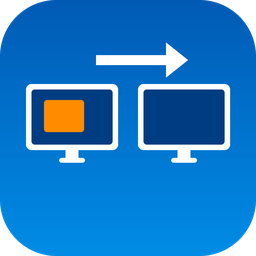

# SendToScreen

Send any running app to another monitor straight from the Windows 11 taskbar.

**Ctrl + right-click** a running app's taskbar button, pick a screen from the menu, and every window of that app moves there. Size and position are kept (clamped to fit), maximized windows stay maximized, minimized windows are restored, and the app comes to the front.

Plain right-click, Shift+right-click and Ctrl+left-click keep their normal taskbar behaviour.

## Install

Download `SendToScreen_Setup_v1.0.0.exe` from the [latest release](https://github.com/jbowensii/SendToScreen/releases/latest) and run it.

- Per-user install, no administrator prompt, code-signed.
- One option: start SendToScreen when you sign in (on by default).
- Lives in the tray; right-click the icon to exit.
- Uninstall from Settings > Apps.

Requires Windows 11 with more than one monitor.

## Why a hook and not a taskbar menu item

Windows 11 offers no API for adding items to a taskbar button's jump list, and the taskbar is a XAML surface owned by Explorer. SendToScreen therefore installs a low-level mouse hook, swallows only the Ctrl + right-click gesture over a taskbar, identifies the button through UI Automation, and shows its own menu. No Explorer injection, no DLLs, no services.

## Footprint

Measured on the installed build at idle: one thread, 0.15 MB working set, 1.6 MB private memory, 0 CPU. The hook callback returns after two integer compares for every mouse event that is not a right-button event with Ctrl held. The exe is 240 KB and depends only on Windows.

## How a button is matched to windows

The Windows 11 taskbar exposes `Appid: <AUMID>` as the button's UI Automation AutomationId. Windows are matched by their AUMID (window property store, else the process's package identity), then by exe path tail for path-style ids, then by the button label against window titles and the exe FileDescription. Registry-only AUMIDs such as Office's land on the label fallback.

Limits: windows of elevated (run-as-administrator) apps cannot be moved by a per-user process; the log shows a match and nothing moves. Hung apps are skipped so the hook never stalls.

## Build

Requires Visual Studio 2022 or later with the C++ workload (CMake and Ninja come with it), and Inno Setup 6 for the installer.

From an x64 Native Tools prompt:

    cmake -G Ninja -B build -DCMAKE_BUILD_TYPE=Release
    cmake --build build
    build\tests.exe

`build.ps1` runs the full release pipeline: render the icon, build, run the unit tests, sign the exe, compile the installer, sign the installer. Signing uses a local SSL.com eSigner wrapper; pass `-NoSign` to skip it. `build.ps1 -Icon A` re-renders `icons\icon.ico` from one of the concepts in `icons\make_icons.py`.

## Layout

| File | Role |
|---|---|
| `main.cpp` | Tray icon, mouse hook, monitor menu, message loop |
| `taskbar.cpp` | UI Automation lookup of the button under the cursor; enumeration of taskbar-eligible windows |
| `logic.cpp` | Pure functions: button id and label parsing, window matching, placement math |
| `mover.cpp` | Monitor enumeration and the restore / move / re-maximize sequence |
| `tests.cpp` | Unit tests for `logic.cpp` (100% line coverage) |
| `installer/SendToScreen.iss` | Inno Setup script |

## Diagnostics

- `SendToScreen.exe --dump` logs every taskbar-eligible window with its title, AUMID, exe and FileDescription.
- Each gesture appends to `%LOCALAPPDATA%\SendToScreen.log` (button id and name, match count, menu pick). The log is capped at 1 MB and removed on uninstall.

## License

MIT. See [LICENSE](LICENSE).
